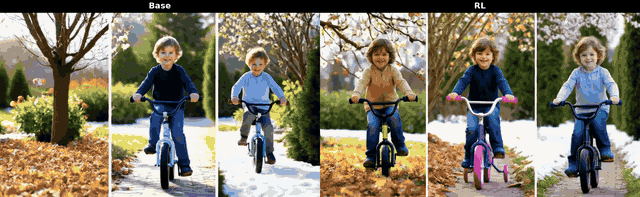
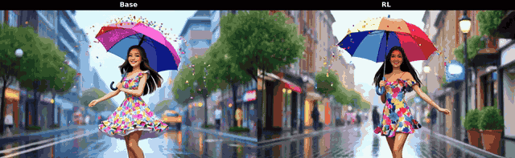

<div align="center">


<h2>Astrolabe: Steering Forward-Process Reinforcement Learning for Distilled Autoregressive Video Models</h2>

[](https://franklinz233.github.io/projects/astrolabe/)
[](https://arxiv.org/abs/2603.17051)
[](LICENSE)

<br>

**[Songchun Zhang](https://franklinz233.github.io/)<sup>1</sup>,
[Zeyue Xue](https://xuezeyue.github.io/)<sup>2,3</sup>,
[Siming Fu](https://scholar.google.com/citations?user=tql_Zc4AAAAJ&hl=zh-CN)<sup>2</sup>,
[Jie Huang](https://huangkevinj.github.io/)<sup>2</sup>,
[Xianghao Kong](https://refkxh.github.io/)<sup>1</sup>,
[Yue Ma](https://mayuelala.github.io/)<sup>1</sup>,
[Haoyang Huang](https://hhyhhyhy.github.io/)<sup>2</sup>,
[Nan Duan](https://nanduan.github.io/)<sup>2✉</sup>,
[Anyi Rao](https://anyirao.com/)<sup>1✉</sup>**

<sup>1</sup>HKUST &nbsp;&nbsp; <sup>2</sup>JD Explore Academy &nbsp;&nbsp; <sup>3</sup>HKU &nbsp;&nbsp; <sup>✉</sup>Corresponding Authors

</div>


## 🔭 Overview
Astrolabe is an efficient online Reinforcement Learning (RL) framework designed to align distilled autoregressive (AR) streaming video models with human visual preferences. Without sacrificing real-time inference speed, Astrolabe consistently and robustly improves visual aesthetics and temporal consistency across various baseline models for both short and long video generation.

## 🎬 Demo

<div align="center">

| Sample 1 | Sample 2 |
|:---:|:---:|
|  |  |
| Sample 3 | Sample 4 |
|  |  |

</div>

## 📢 News

- **2026-03-23** — Code released!
- **2026-03-18** — Paper released on [arXiv](https://arxiv.org/abs/2603.17051)!


## 📑 Table of Contents

- [Supported Methods & Rewards](#-supported-methods--rewards)
- [Quick Start](#-quick-start)
- [Inference](#-inference)
- [Extension Guide](#-extension-guide)
- [Citation](#-citation)
- [Acknowledgement](#-acknowledgement)


## 📊 Supported Methods & Rewards

### Supported Base Models

| Model | Config File |
|---|---|
| **LongLive** | `configs/nft_longlive.py` |
| **Self-Forcing** | `configs/nft_self_forcing.py` |
| **Causal Forcing** | `configs/nft_casual_forcing.py` |
| **Krea 14B** | `configs/nft_krea14b.py` |

### Supported Reward Models

| Reward | Key in Config | What It Measures | Source |
|---|---|---|---|
| **HPSv3** | `video_hpsv3_local` | Frame-level aesthetic & visual quality | [HPSv3](https://huggingface.co/MizzenAI/HPSv3) |
| **VideoAlign – VQ** | `videoalign_vq_score` | Per-frame visual fidelity scored by VideoReward | [VideoReward](https://huggingface.co/KlingTeam/VideoReward) |
| **VideoAlign – MQ** | `videoalign_mq_score` | Temporal smoothness & motion naturalness | [VideoReward](https://huggingface.co/KlingTeam/VideoReward) |
| **VideoAlign – TA** | `videoalign_ta_score` | Prompt–video semantic alignment | [VideoReward](https://huggingface.co/KlingTeam/VideoReward) |

Rewards can be freely combined with per-reward weights, e.g. `reward_fn={"video_hpsv3_local": 1.0, "videoalign_mq_score": 1.0}`.

---

## 🚀 Quick Start

### 1. Environment Setup

> **Tested configuration:** Python 3.10.16, CUDA 12.8, NVIDIA H200 GPUs

```bash
# Clone the repository
git clone https://github.com/franklinz233/Astrolabe.git
cd Astrolabe

# Create and activate conda environment
conda create -n astrolabe python=3.10.16
conda activate astrolabe

pip install torch==2.6.0 torchvision==0.21.0 --index-url https://download.pytorch.org/whl/cu124

# Install other dependencies
pip install -r requirements.txt

# Install Flash Attention (pre-built wheel for CUDA 12 + PyTorch 2.6)
pip install flash-attn==2.7.4.post1 --no-build-isolation

# You can also download the pre-build wheel
wget https://github.com/Dao-AILab/flash-attention/releases/download/v2.7.4.post1/flash_attn-2.7.4.post1+cu12torch2.6cxx11abiFALSE-cp310-cp310-linux_x86_64.whl
pip install flash_attn-2.7.4.post1+cu12torch2.6cxx11abiFALSE-cp310-cp310-linux_x86_64.whl
```

### 2. Model Download

We support four distilled AR video model baselines. Download the base Wan2.1 model and the desired distilled checkpoint(s):

#### Base Model

```bash
huggingface-cli download Wan-AI/Wan2.1-T2V-1.3B --local-dir wan_models/Wan2.1-T2V-1.3B
```

#### Distilled Model Checkpoints

<details>
<summary><b>Self-Forcing</b></summary>

```bash
huggingface-cli download gdhe17/Self-Forcing checkpoints/self_forcing_dmd.pt --local-dir .
```
</details>

<details>
<summary><b>Causal Forcing</b></summary>

```bash
huggingface-cli download zhuhz22/Causal-Forcing chunkwise/causal_forcing.pt --local-dir checkpoints/casualforcing
huggingface-cli download zhuhz22/Causal-Forcing framewise/causal_forcing.pt --local-dir checkpoints/casualforcing
```
</details>

<details>
<summary><b>LongLive</b></summary>

```bash
huggingface-cli download Efficient-Large-Model/LongLive-1.3B --include "models/*" --local-dir checkpoints/longlive_models
```
</details>

<details>
<summary><b>Krea 14B</b></summary>

```bash
huggingface-cli download krea/krea-realtime-video \
  krea-realtime-video-14b.safetensors \
  --local-dir checkpoints
```
</details>

#### Expected Directory Structure

```
checkpoints/
├── casualforcing/
│   ├── chunkwise/
│   │   └── causal_forcing.pt
│   └── framewise/
│       └── causal_forcing.pt
├── krea-realtime-video-14b.safetensors
├── longlive_models/
│   └── models/
│       ├── longlive_base.pt
│       └── lora.pt
└── self_forcing_dmd.pt
```

### 3. Reward Models Preparation

Download reward model checkpoints:

```bash
mkdir -p reward_ckpts && cd reward_ckpts

# CLIP backbone (required by HPSv2/v3)
wget https://huggingface.co/laion/CLIP-ViT-H-14-laion2B-s32B-b79K/resolve/main/open_clip_pytorch_model.bin

# HPSv2.1 checkpoint
wget https://huggingface.co/xswu/HPSv2/resolve/main/HPS_v2.1_compressed.pt

# HPSv3 checkpoint
wget https://huggingface.co/MizzenAI/HPSv3/resolve/main/HPSv3.safetensors

# VideoReward checkpoint
huggingface-cli download KlingTeam/VideoReward --local-dir ./Videoreward
```

### 4. Start Training

#### Training Prompts

Download the filtered [VidProM](https://github.com/WangWilliamYang/VidProM) prompt subset used for training:

```bash
huggingface-cli download Franklinzhang/stream_align \
  --include "vidprom/*" \
  --local-dir ./dataset
```

#### W&B Logging (Optional but Recommended)

```bash
export WANDB_API_KEY=<your_key>
export WANDB_ENTITY=<your_entity>
```

---

> **GPU presets:** Training parameters like `num_image_per_prompt`, `num_groups`, and `test_batch_size` are auto-configured per GPU scale in `GPU_CONFIGS` inside `configs/_base_clean.py`. Add or edit entries there for custom GPU counts.

> **Multi-node setup:** If your cluster cannot resolve `MASTER_ADDR` automatically, use a shared filesystem for node discovery. Run on **each node**, setting `RANK=0` on master and `RANK=1,2,...` on workers:
>
> ```bash
> export RANK=<node_rank>       # 0 for master, 1, 2, ... for workers
> export WORLD_SIZE=<num_nodes> # 2→16 GPUs (2×8), 3→24 GPUs (3×8), 6→48 GPUs (6×8)
> export MASTER_PORT=29500
> CONFIG_NAME=<config_name>
>
> torchrun --nproc_per_node=8 --nnodes=$WORLD_SIZE \
>     --node_rank=$RANK \
>     --master_addr=$MASTER_ADDR \
>     --master_port=$MASTER_PORT \
>     scripts/train_nft_wan.py \
>     --config configs/nft_<model>.py:${CONFIG_NAME}
> ```
>
> **Multi-reward:** Replace `hpsv3` with `multi_reward` in any config name to enable the full multi-reward objective (HPSv3 + Motion Quality).

---

#### LongLive

> 💡 **LoRA Initialization (recommended for LongLive):** LongLive ships a pretrained LoRA adapter (`checkpoints/longlive_models/models/lora.pt`) that can be used to warm-start training. Simply append `_with_lora_init` to any LongLive config name to enable it — the adapter is loaded before RL training begins and typically leads to faster convergence.

<details>
<summary><b>Single Node (8× GPU)</b></summary>

```bash
# HPSv3 reward
torchrun --nproc_per_node=8 scripts/train_nft_wan.py \
    --config configs/nft_longlive.py:longlive_video_hpsv3

# HPSv3 reward — with LoRA init
torchrun --nproc_per_node=8 scripts/train_nft_wan.py \
    --config configs/nft_longlive.py:longlive_video_hpsv3_with_lora_init

# Multi-reward (HPSv3 + Motion Quality)
torchrun --nproc_per_node=8 scripts/train_nft_wan.py \
    --config configs/nft_longlive.py:longlive_video_multi_reward
```
</details>

<details>
<summary><b>Multi-Node (16× / 24× / 48× GPU)</b></summary>

| Scale | HPSv3 Config | HPSv3 + LoRA Init | Multi-Reward Config |
|---|---|---|---|
| 16× GPU | `longlive_video_hpsv3_16gpu` | `longlive_video_hpsv3_with_lora_init_16gpu` | `longlive_video_multi_reward_16gpu` |
| 24× GPU | `longlive_video_hpsv3_24gpu` | `longlive_video_hpsv3_with_lora_init_24gpu` | `longlive_video_multi_reward_24gpu` |
| 48× GPU | `longlive_video_hpsv3_48gpu` | `longlive_video_hpsv3_with_lora_init_48gpu` | `longlive_video_multi_reward_48gpu` |
</details>


---

#### Self-Forcing

<details>
<summary><b>Single Node (8× GPU)</b></summary>

```bash
# HPSv3 reward
torchrun --nproc_per_node=8 scripts/train_nft_wan.py \
    --config configs/nft_self_forcing.py:self_forcing_video_hpsv3

# Multi-reward (HPSv3 + Motion Quality)
torchrun --nproc_per_node=8 scripts/train_nft_wan.py \
    --config configs/nft_self_forcing.py:self_forcing_video_multi_reward
```
</details>

<details>
<summary><b>Multi-Node (16× / 24× / 48× GPU)</b></summary>

| Scale | HPSv3 Config | Multi-Reward Config |
|---|---|---|
| 16× GPU | `self_forcing_video_hpsv3_16gpu` | `self_forcing_video_multi_reward_16gpu` |
| 24× GPU | `self_forcing_video_hpsv3_24gpu` | `self_forcing_video_multi_reward_24gpu` |
| 48× GPU | `self_forcing_video_hpsv3_48gpu` | `self_forcing_video_multi_reward_48gpu` |
</details>

---

#### Causal Forcing

<details>
<summary><b>Single Node (8× GPU)</b></summary>

```bash
# HPSv3 reward
torchrun --nproc_per_node=8 scripts/train_nft_wan.py \
    --config configs/nft_casual_forcing.py:casual_forcing_video_hpsv3

# Multi-reward (HPSv3 + Motion Quality)
torchrun --nproc_per_node=8 scripts/train_nft_wan.py \
    --config configs/nft_casual_forcing.py:casual_forcing_video_multi_reward
```
</details>

<details>
<summary><b>Multi-Node (16× / 24× / 48× GPU)</b></summary>

| Scale | HPSv3 Config | Multi-Reward Config |
|---|---|---|
| 16× GPU | `casual_forcing_video_hpsv3_16gpu` | `casual_forcing_video_multi_reward_16gpu` |
| 24× GPU | `casual_forcing_video_hpsv3_24gpu` | — |
| 48× GPU | `casual_forcing_video_hpsv3_48gpu` | `casual_forcing_video_multi_reward_48gpu` |
</details>

---

#### Krea 14B
<details>
<summary><b>Single Node (8× GPU)</b></summary>

```bash
# HPSv3 reward
torchrun --nproc_per_node=8 scripts/train_nft_wan.py \
    --config configs/nft_krea14b.py:krea14b_video_hpsv3

# Multi-reward (HPSv3 + Motion Quality)
torchrun --nproc_per_node=8 scripts/train_nft_wan.py \
    --config configs/nft_krea14b.py:krea14b_video_multi_reward
```
</details>

<details>
<summary><b>Multi-Node (16× / 24× / 48× GPU)</b></summary>

| Scale | HPSv3 Config | Multi-Reward Config |
|---|---|---|
| 16× GPU | `krea14b_video_hpsv3_16gpu` | `krea14b_video_multi_reward_16gpu` |
| 24× GPU | `krea14b_video_hpsv3_24gpu` | `krea14b_video_multi_reward_24gpu` |
| 48× GPU | `krea14b_video_hpsv3_48gpu` | `krea14b_video_multi_reward_48gpu` |
</details>

---

### Training Output Structure

Training checkpoints are saved under `logs/nft/<base_model>/<run_name>_<timestamp>/`:

```
logs/nft/wan_self/<run_name>_<timestamp>/
├── checkpoints/
│   ├── checkpoint-<train_step>/
│   │   └── lora/
│   │       ├── adapter_model.bin      # LoRA weights
│   │       └── adapter_config.json    # LoRA config
│   └── ...
└── eval_videos/                        # Evaluation videos
```

**Run name convention:** `nft_<base_model>_<config_name>`

| Base Model | Directory | Run Name Prefix |
|------------|-----------|-----------------|
| LongLive | `wan_longlive` | `nft_wan_longlive` |
| Self-Forcing | `wan_self` | `nft_wan_self` |
| Causal Forcing | `wan_casual_chunk` | `nft_wan_casual_chunk` |
| Krea 14B | `wan_krea14b` | `nft_wan_krea14b` |

**Example:**
```bash
# After training with config: self_forcing_video_hpsv3
# run_name = nft_wan_self_self_forcing_video_hpsv3
# save_dir = logs/nft/wan_self/self_forcing_video_hpsv3_<timestamp>

torchrun --nproc_per_node=1 scripts/inference_wan.py \
    --base_model checkpoints/self_forcing_dmd.pt \
    --lora_path logs/nft/wan_self/self_forcing_video_hpsv3_<timestamp>/checkpoints/checkpoint-30 \
    --prompt "A cat running in the park" \
    --output_dir outputs/test
```

> 💡 The inference script auto-detects the `lora/` subdirectory, so you can pass either the checkpoint directory or the `lora/` path directly.

## 🎬 Inference

Use `scripts/inference_wan.py` to generate videos with a trained LoRA checkpoint.

#### Single Prompt

```bash
torchrun --nproc_per_node=1 scripts/inference_wan.py \
    --base_model <base_model_path> \
    --lora_path <checkpoint_dir> \
    --prompt "A cat running in the park" \
    --output_dir outputs/test
```

#### Long Video (e.g., 240 frames)

```bash
torchrun --nproc_per_node=1 scripts/inference_wan.py \
    --base_model <base_model_path> \
    --lora_path <checkpoint_dir> \
    --prompt "A cat running in the park" \
    --num_frames 240 \
    --output_dir outputs/long_video
```

#### Batch Inference (Multi-GPU)

Provide a plain text file with one prompt per line:

```bash
torchrun --nproc_per_node=8 scripts/inference_wan.py \
    --base_model <base_model_path> \
    --lora_path <checkpoint_dir> \
    --prompt_file prompts/test.txt \
    --output_dir outputs/batch
```

> 💡 `--lora_path` accepts either a checkpoint directory (e.g., `checkpoint-300`) or the `lora/` subdirectory directly — the script auto-detects both.

#### Scene / Prompt Switching

For long videos, you can **switch the text prompt mid-generation** to create seamless scene transitions — no extra flags needed. Simply separate scene prompts with `|` in a single prompt string. The script automatically activates `SceneCausalInferencePipeline` when it detects the `|` separator.

**Prompt syntax:**

| Syntax | Meaning |
|---|---|
| `prompt1 \| prompt2` | Two scenes, each using the default duration (~10.5 s) |
| `prompt1[5s] \| prompt2[15s]` | Explicit duration per scene in seconds |
| `prompt1[10s#] \| prompt2` | `#` marks a **hard scene cut** at the boundary (KV-cache is flushed) |

**Examples:**

```bash
# Two scenes with default duration
torchrun --nproc_per_node=1 scripts/inference_wan.py \
    --base_model <base_model_path> \
    --prompt "A cat running in the park | A dog sleeping on the sofa" \
    --num_frames 240 \
    --output_dir outputs/scene_switch

# Explicit scene durations
torchrun --nproc_per_node=1 scripts/inference_wan.py \
    --base_model <base_model_path> \
    --prompt "A sunrise over mountains[8s] | A busy city street at noon[12s] | A quiet beach at sunset[10s]" \
    --num_frames 480 \
    --output_dir outputs/three_scenes

# Hard scene cut (abrupt transition, KV-cache flushed)
torchrun --nproc_per_node=1 scripts/inference_wan.py \
    --base_model <base_model_path> \
    --prompt "A cat playing with yarn[10s#] | A bird flying over a lake" \
    --num_frames 240 \
    --output_dir outputs/hard_cut

# Batch: put one scene-switched prompt per line in the file
torchrun --nproc_per_node=8 scripts/inference_wan.py \
    --base_model <base_model_path> \
    --lora_path <checkpoint_dir> \
    --prompt_file prompts/scene_prompts.txt \
    --num_frames 240 \
    --output_dir outputs/batch_scenes
```


> 💡 **Soft vs. hard transitions:** Without `#`, the KV-cache is rolled forward so the model retains memory of the previous scene, producing a smooth transition. Adding `#` flushes the cache for a sharp cut, similar to a film edit.


## 🔧 Extension Guide

### Adding a New Reward

**1. Implement** the scorer in `astrolabe/rewards.py`:

```python
def my_reward(device):
    scorer = MyScorer(device=device)  # load once at init

    def _fn(videos, prompts, metadata=None):
        # videos: Tensor [B, F, C, H, W] in [0,1] (video) or [B, C, H, W] (image)
        scores = scorer(videos, prompts)
        return scores, {}  # scores: list or np.array of shape [B]

    return _fn
```

**2. Register** it in the `score_functions` dict inside `multi_score()`:

```python
score_functions = {
    ...
    "my_reward": my_reward,
}
```

**3. Use** it in a config: `reward_fn={"my_reward": 1.0}`.

---

### Adding a New Config

Create `configs/nft_mymodel.py` following `configs/nft_longlive.py`:

```python
import os, imp
_base = imp.load_source("_base_clean", os.path.join(os.path.dirname(__file__), "_base_clean.py"))

def get_config(name):
    return globals()[name]()

def _get_config(n_gpus=8, gradient_step_per_epoch=1, dataset="vidprom", reward_fn={}, name=""):
    config = _base._make_base_config(dataset)
    config.base_model = "wan_longlive"  # or wan_self, wan_casual_chunk, wan_casual_frame
    _base._apply_wan_common(config)
    config.pretrained.model = "./checkpoints/my_model.pt"
    config.model_kwargs = {}

    gpu_config = _base._get_gpu_config("wan", n_gpus)  # or "sd3" / "krea14b"
    config.sample.num_image_per_prompt = gpu_config["num_image_per_prompt"]
    config.sample.test_batch_size = gpu_config["test_batch_size"]
    _base._apply_batch_config(config, n_gpus, gpu_config["bsz"], gpu_config["num_groups"], gradient_step_per_epoch)
    _base._apply_common_fields(config, "wan_longlive", dataset, reward_fn, name)
    return config

def my_config_hpsv3():
    config = _get_config(n_gpus=8, reward_fn={"video_hpsv3_local": 1.0}, name="my_config_hpsv3")
    config.beta = 0.1
    config.train.learning_rate = 1e-5
    return config
```

Then train with:
```bash
torchrun --nproc_per_node=8 scripts/train_nft_wan.py --config configs/nft_mymodel.py:my_config_hpsv3
```

Key parameters to tune: `config.beta` (NFT beta, default `1.0`), `config.train.beta` (KL weight, default `0.0001`), `config.train.learning_rate` (`1e-5` for Wan), `config.sample.noise_level` (default `0.7`).

---

### Adding a New Model

**1.** Add a wrapper class in `utils/` following `utils/wan_wrapper.py`. You need `WanTextEncoder`-style text encoder, `WanVAEWrapper`-style VAE, and a `WanDiffusionWrapper`-style denoiser.

**2.** Register the new `base_model` key in the model-loading block of the training script (e.g. `scripts/train_nft_wan.py`), alongside existing entries like `wan_longlive`, `wan_self`, etc.

**3.** Add a GPU preset in `configs/_base_clean.py` under `GPU_CONFIGS` if the model needs different batch sizes than the existing `"wan"` preset.

---

### Adding a New Inference Pipeline

All inference pipelines inherit from `CausalInferencePipeline` (`pipeline/causal_inference.py`), which implements block-wise autoregressive generation with KV-cache management. Existing pipelines include `SceneCausalInferencePipeline` (multi-scene prompt switching) and `InteractiveCausalInferencePipeline` (interactive prompt switching with KV re-caching).

**1.** Subclass `CausalInferencePipeline` in `pipeline/` and override `inference()`:

```python
# pipeline/my_pipeline.py
from pipeline.causal_inference import CausalInferencePipeline

class MyCausalInferencePipeline(CausalInferencePipeline):
    def inference(self, noise, text_prompts, **kwargs):
        # Inherited: self.generator, self.text_encoder, self.vae,
        #            self.kv_cache1, self.denoising_step_list, etc.
        ...
```

**2.** Register in `pipeline/__init__.py` and import in your inference script.

## 🎓 Citation

If you find our work useful, please consider citing:

```bibtex
@article{zhang2026astrolabe,
  title   = {Astrolabe: Steering Forward-Process Reinforcement Learning for Distilled Autoregressive Video Models},
  author  = {Zhang, Songchun and Xue, Zeyue and Fu, Siming and Huang, Jie and Kong, Xianghao and Ma, Yue and Huang, Haoyang and Duan, Nan and Rao, Anyi},
  journal = {arXiv preprint arXiv:2603.17051},
  year    = {2026}
}
```


## 🤝 Acknowledgement

This project builds upon the following outstanding open-source works:

- [Self-Forcing](https://self-forcing.github.io/) — Self-forcing training for autoregressive video diffusion
- [LongLive](https://nvlabs.github.io/LongLive/) — Long-form video generation via generative extrapolation
- [CausVid / Causal Forcing](https://causal-forcing.github.io/) — AR teacher distillation with causal attention
- [Wan](https://wan.video/) — Base video diffusion transformer
- [DiffusionNFT](https://arxiv.org/abs/2410.05760) — Negative-aware fine-tuning for forward-process RL

<br>

<div align="center">

**⭐ If you find Astrolabe useful, please give us a star!**

</div>


